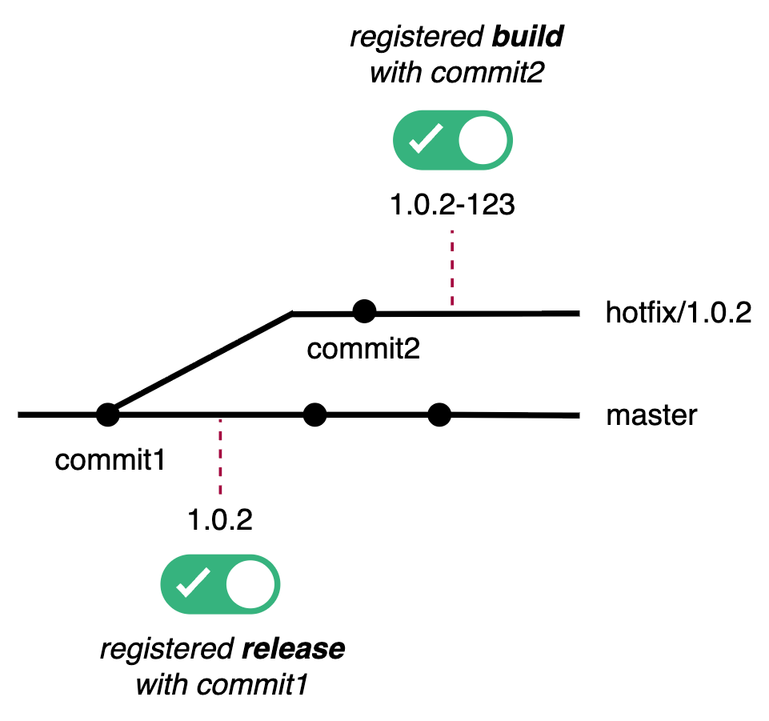
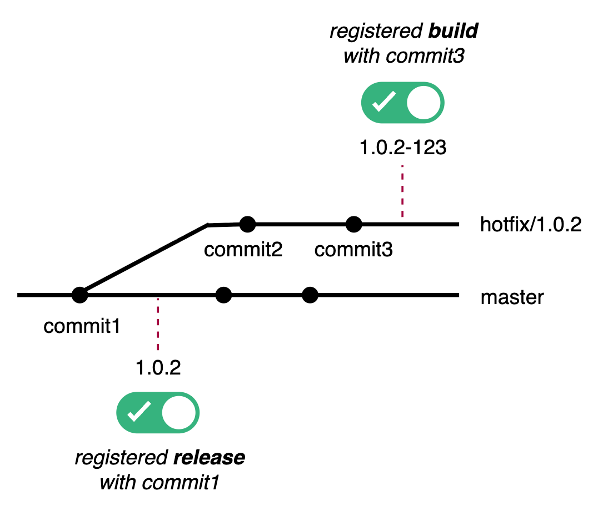
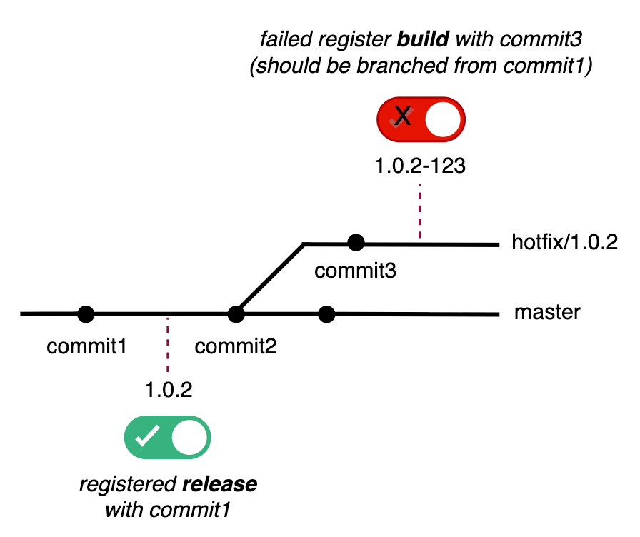
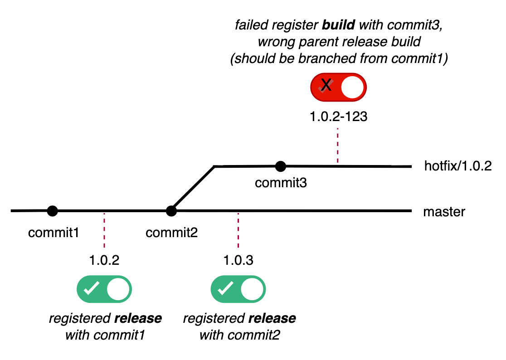
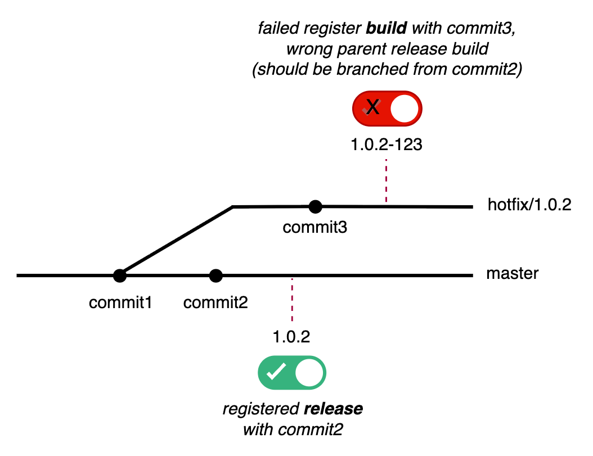
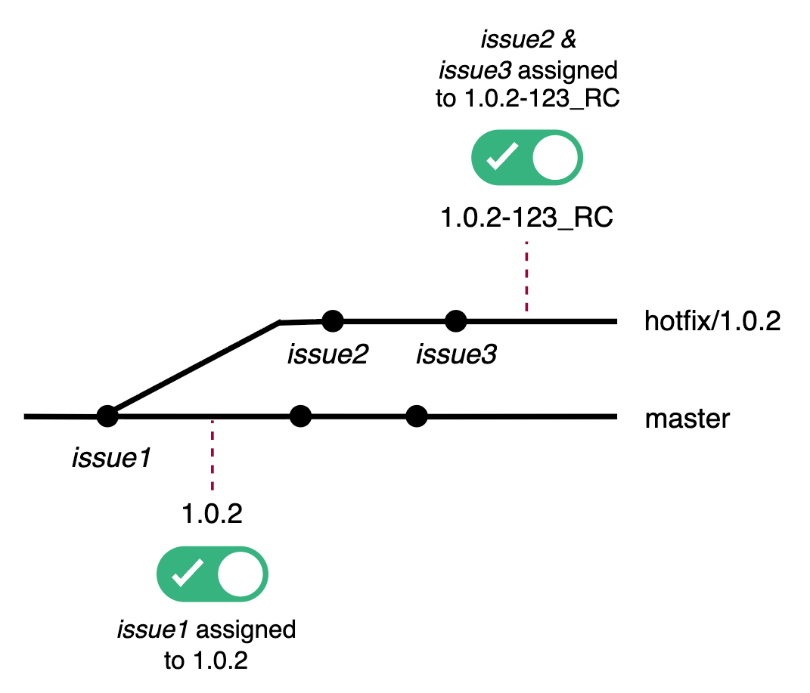
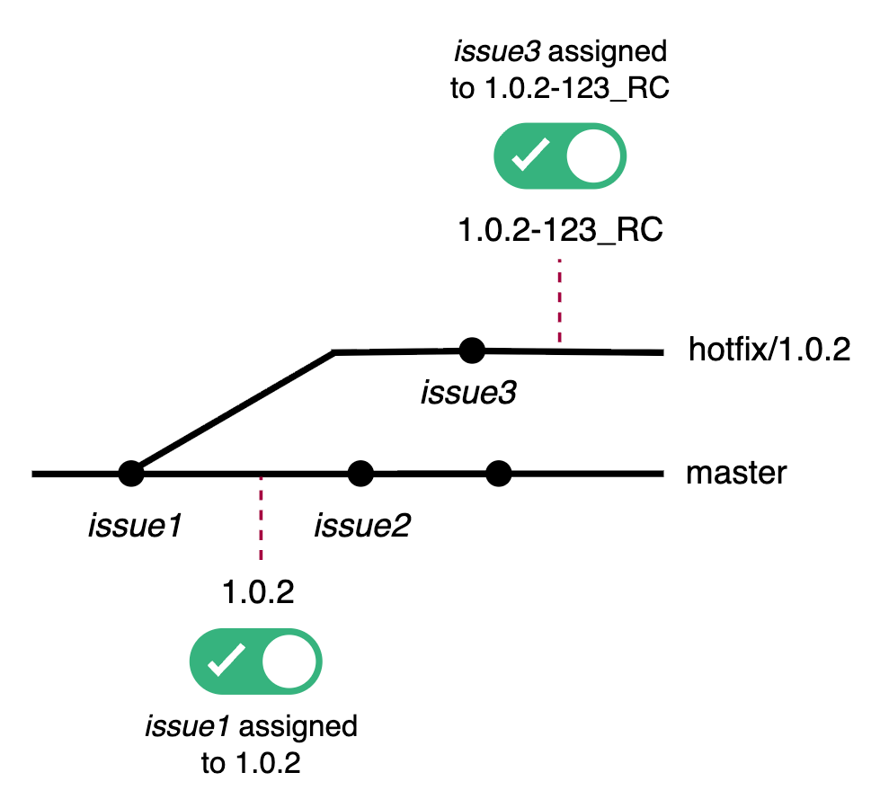
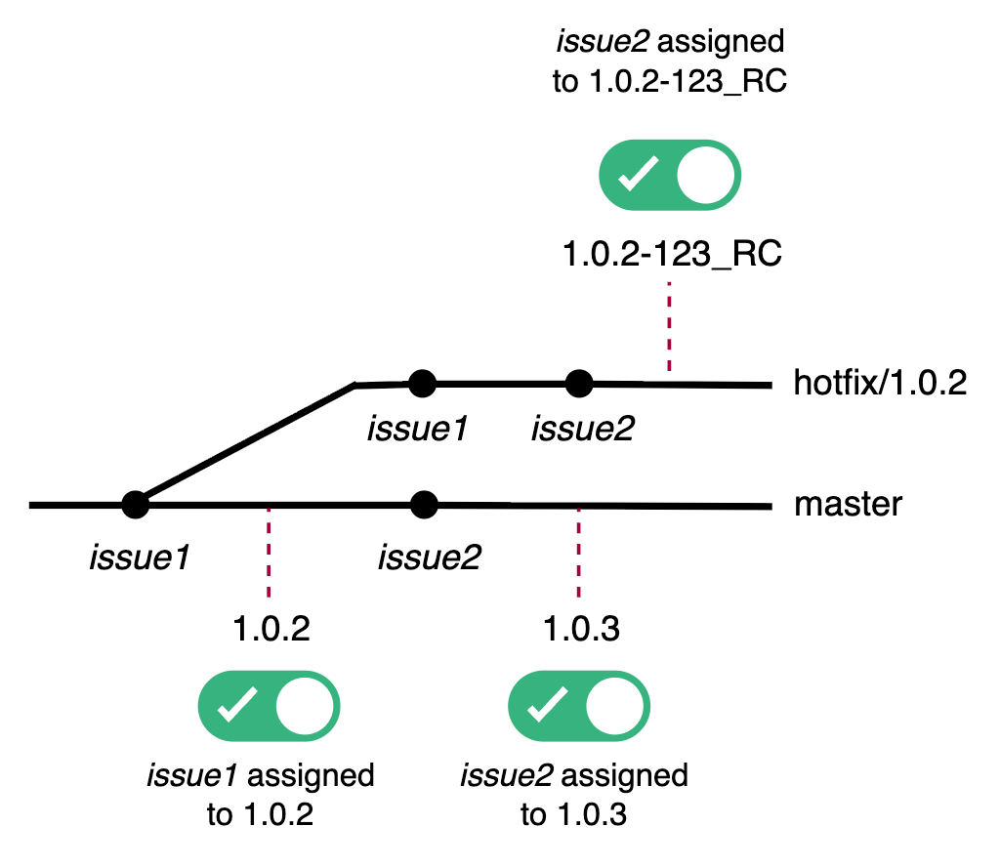
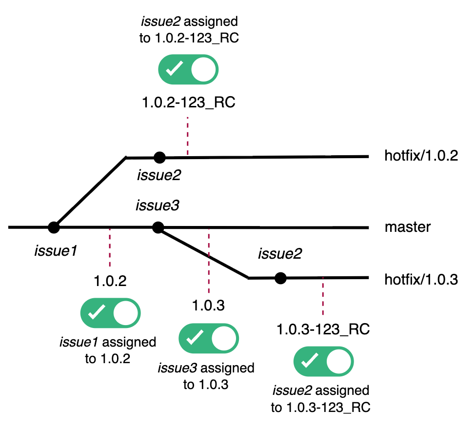
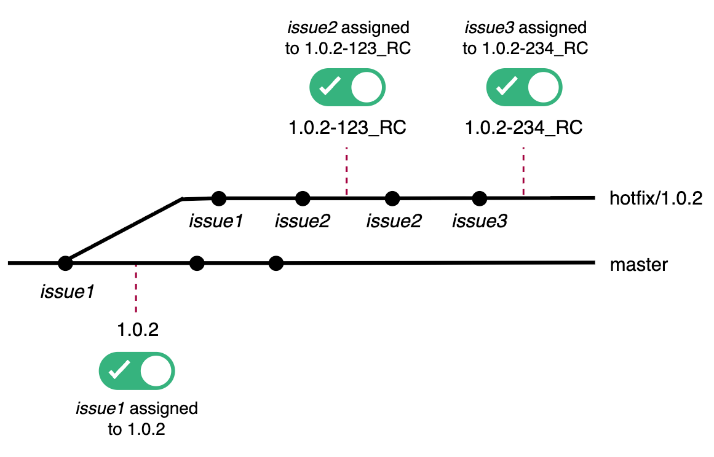

# Hotfix Support

## Hotfix Branch Rules

### Prerequisites
A hotfix build can only be performed if:
- The component has a `hotfixBranch` registered in the component registry
- The hotfix build is registered from a branch matching the `hotfixBranch`
- **The hotfix branch is created from the exact commit of the parent release build**

### Example Configuration
```groovy
jira {
    majorVersionFormat = '$major.$minor'
    releaseVersionFormat = '$major.$minor.$service'
    hotfixVersionFormat = '$major.$minor.$service-$fix'
}
vcsSettings {
    hotfixBranch = 'hotfix/$major.$minor.$service'
}
```

For version `1.2.3-1`:
- Must be built from branch `hotfix/1.2.3`
- Branch `hotfix/1.2.3` must be branched from the commit of release `1.2.3`

### Valid Hotfix Branches

**Single commit before first hotfix build:**


**Multiple commits before first hotfix build:**


### Invalid Hotfix Branches
The hotfix branch must not be branched from the wrong commit:





---

## Hotfix Issue Assignment

During hotfix RC registration, Jira issues found in VCS commits are automatically assigned to the hotfix version.

### Assignment Rules
- Only **resolved** issues are eligible for version assignment
- Issues are **excluded** if they already have:
  - A hotfix version from the same minor version, OR
  - A version from the parent release

### Same Branch Parent
Same branch parent must be connected in the VCS graph. For hotfix build, it will be based on:
- Previous RC/release hotfix build with the same minor version, OR
- Parent release build from which the hotfix branch was created

---

## Scenarios

### Scenario 1: Issue Included on Hotfix Commit


**Results:**

| Issue  | Fix Version(s)   |
|--------|------------------|
| issue1 | 1.0.2            | 
| issue2 | 1.0.2-123_RC     | 
| issue3 | 1.0.2-123_RC     | 

**Same Branch Parent:**

| Release/RC   | Same Branch Parent |
|--------------|--------------------|
| 1.0.2-123_RC | 1.0.2              |

---

### Scenario 2: Issue on Master Not Included on Hotfix


**Results:**

| Issue  | Fix Version(s) |
|--------|----------------|
| issue1 | 1.0.2          | 
| issue2 | *(empty)*      | 
| issue3 | 1.0.2-123_RC   |                                       

**Same Branch Parent:**

| Release/RC   | Same Branch Parent |
|--------------|--------------------|
| 1.0.2-123_RC | 1.0.2              |

---

### Scenario 3: Same Issue Used for Parent and Hotfix Build


**Results:**

| Issue  | Fix Version(s)      |
|--------|---------------------|
| issue1 | 1.0.2               |
| issue2 | 1.0.3, 1.0.2-123_RC |

**Same Branch Parent:**

| Release/RC   | Same Branch Parent |
|--------------|--------------------|
| 1.0.3        | 1.0.2              |
| 1.0.2-123_RC | 1.0.2              |

---

### Scenario 4: Same Issue on Different Hotfix Minor Versions


**Results:**

| Issue  | Fix Version(s)             |
|--------|----------------------------|
| issue1 | 1.0.2                      |
| issue2 | 1.0.2-123_RC, 1.0.3-123_RC |
| issue3 | 1.0.3                      |

**Same Branch Parent:**

| Release/RC   | Same Branch Parent |
|--------------|--------------------|
| 1.0.3        | 1.0.2              | 
| 1.0.2-123_RC | 1.0.2              | 
| 1.0.3-123_RC | 1.0.3              | 

---

### Scenario 5: Same Issue on Same Hotfix Minor Version


**Results:**

| Issue  | Fix Version(s) |
|--------|----------------|
| issue1 | 1.0.2          |
| issue2 | 1.0.2-123_RC   |
| issue3 | 1.0.2-234_RC   |

**Same Branch Parent:**

| Release/RC   | Same Branch Parent |
|--------------|--------------------|
| 1.0.2-123_RC | 1.0.2              |
| 1.0.2-234_RC | 1.0.2-123_RC       |